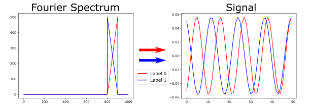
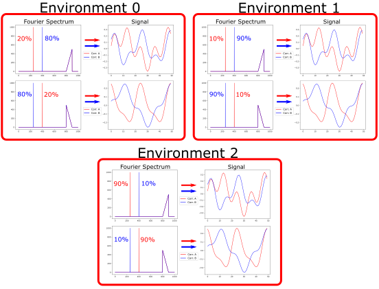
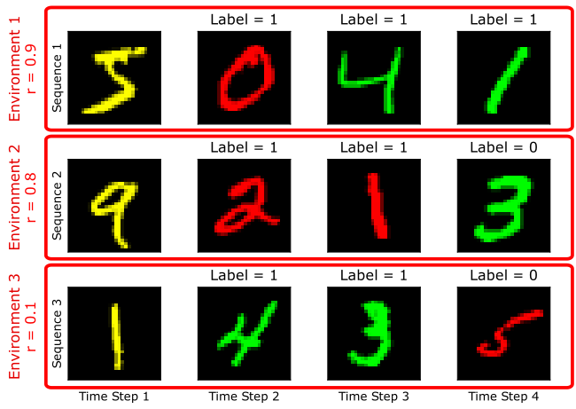
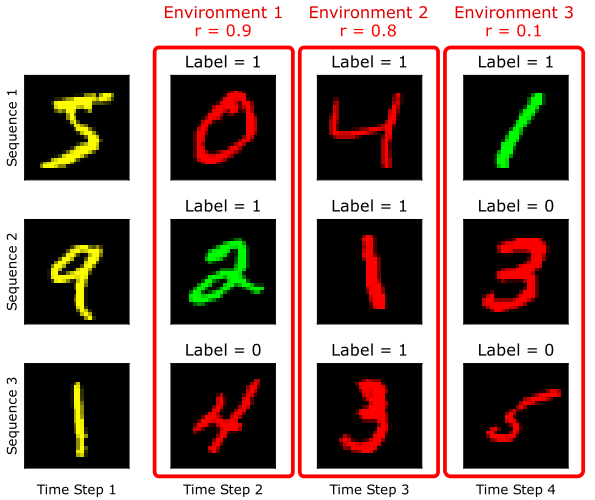

# Temporal_OOD
Repository aiming to benchmark OOD performance of temporal data.

# Current benchmarks
## Spurious Fourier
### The task
The task is to classify Fourier spectrum from observed signals.

### Spurious Version
In the spurious version of the dataset, we add a spike in the Fourier spectrum that is correlated with the label.

## Temporal ColoredMNIST
### Greyscale
We create a sequence of 4 digits (one digit per frame) and the task is to predict if the sum of the last digit and the current digit is an odd number.

### OOD setup
We add 25% label noise to the dataset and add colors to the images that is correlated with different degrees to the labels. This degree of correlation is dictated by the environment from which the sample is taken from.

## Definition of environments
Two definition of environments are of interest in this dataset.

### Sequences as environments
First definition of interest is the setup where a single sequence is taken from an enviroment and the level of correlation between the color and the label is constant across time-steps.

### Time steps as environments
The second definition of interest is the setup where every time step is an environment, so sequences of data have different level of correlation of color within the sequence

