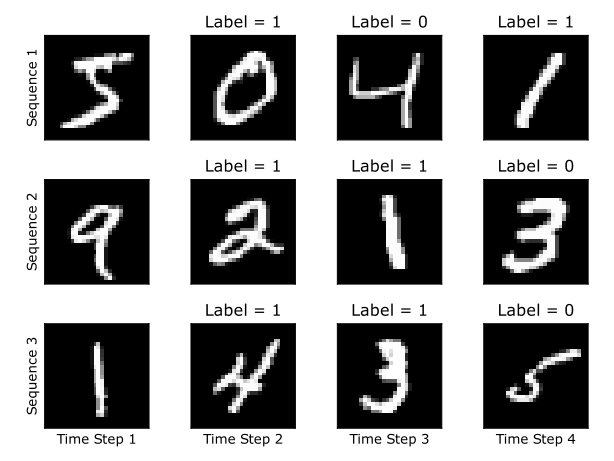

# Temporal_OOD
Repository aiming to benchmark OOD performance of temporal data.

## Quick Start

Train a single model using one objective on one dataset with one test environment

```sh
python3 temporal_OOD.py \
        --dataset PhysioNet \
        --objective ERM \
        --test_env 0
```

To launch a sweep, use the following script. Define a collection of Objective and Dataset to investigate a combination. All test environment are gonna be investigated automatically. By default, the sweep is gonna do a random search over 20 hyper parameter seeds with 3 trial seed each.

```sh
python3 hparams_sweep.py \
        --dataset Spurious_Fourier \
        --objective ERM IRM \
        --save_path ./results \
        --launcher local
```

To change the number of seeds investigated, you can call the `--n_hparams` and `--n_trials` argument.

```sh
python3 hparams_sweep.py \
        --dataset Spurious_Fourier TCMNIST_seq \
        --objective ERM IRM \
        --save_path ./results \
        --launcher local \
        --n_hparams 10 \
        --n_trials 2
```

You can also specify which test environment you want to investigate using the `--unique_test_env` argument

```sh
python3 hparams_sweep.py \
        --dataset Spurious_Fourier TCMNIST_seq \
        --objective ERM IRM \
        --save_path ./results \
        --launcher local \
        --unique_test_env 0
```

When the sweep is complete you can compile the results in neat tables

```sh
python3 compile_results.py \
        --results_dir /hdd/Results/temporal_OOD/Spurious_Fourier/1 \
        --latex
```

## Current benchmarks
### Spurious Fourier
#### The task
The task is to classify Fourier spectrum from observed signals.


#### Spurious Version
In the spurious version of the dataset, we add a spike in the Fourier spectrum that is correlated with the label.


### Temporal ColoredMNIST
#### Greyscale
We create a sequence of 4 digits (one digit per frame) and the task is to predict if the sum of the last digit and the current digit is an odd number.



#### OOD setup
We add 25% label noise to the dataset and add colors to the images that is correlated with different degrees to the labels. This degree of correlation is dictated by the environment from which the sample is taken from.

### Definition of environments
Two definition of environments are of interest in this dataset.

#### Sequences as environments
First definition of interest is the setup where a single sequence is taken from an enviroment and the level of correlation between the color and the label is constant across time-steps.


#### Time steps as environments
The second definition of interest is the setup where every time step is an environment, so sequences of data have different level of correlation of color within the sequence


